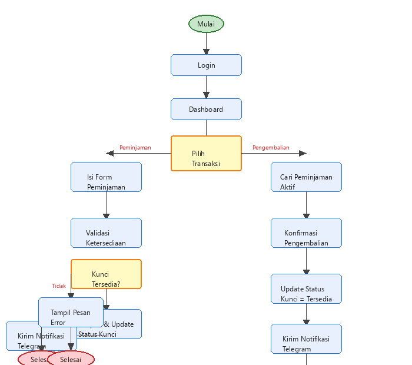
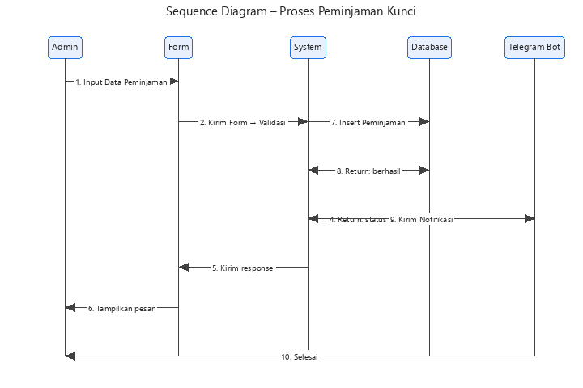

### LAPORAN CAPSTONE DESIGN
### SISTEM INFORMASI PEMINJAMAN KUNCI LABORATORIUM BERBASIS WEB DENGAN NOTIFIKASI TELEGRAM

#### DOSEN PEMBIMBING
1. Budiman, S.Kom.,MM.,M.Kom.

**Disusun Oleh :**

**1. Muhammad Arvin Naza**
**(232355201017)**

**2. Delvin Farrel Hasani**
**(232355201006)**

**3. Noval Krisnanda Syahputra**
**(232355201002)**

#### PROGRAM STUDI TEKNIK INFORMATIKA
#### FAKULTAS TEKNIK
#### UNIVERSITAS DARUL 'ULUM JOMBANG
#### 2026/2026
ii

**LEMBAR PENGESAHAN**

**LAPORAN CAPSTONE DESIGN**

**JUDUL: SISTEM INFORMASI PEMINJAMAN KUNCI LABORATORIUM BERBASIS WEB DENGAN NOTIFIKASI TELEGRAM**

**Anggota Tim :**

**1. Muhammad Arvin Naza**
**(232355201017)**

**2. Delvin Farrel Hasani**
**(232355201006)**

**3. Noval Krisnanda Syahputra**
**(232355201002)**

Laporan ini disusun untuk memenuhi nilai pada Mata Kuliah **Capstone Design**

Mahasiswa Program Studi Teknik Informatika Fakultas Teknik

Universitas Darul 'Ulum Jombang

Jombang, 15 Agustus 2026

Menyetujui,

Dosen Pembimbing
_________________
**Budiman, S.Kom.,MM.,M.Kom.**
NIDN.

Ketua Program Studi

Teknik Informatika

**Budiman, S.Kom.,MM.,M.Kom.**

NPP. 204. 501. 115

iii

**RINGKASAN EKSEKUTIF**

Sistem Informasi Peminjaman Kunci Laboratorium merupakan aplikasi berbasis web yang dibangun untuk menggantikan pencatatan peminjaman kunci laboratorium secara manual (buku catatan) menjadi sistem digital yang lebih terstruktur, akurat, dan mudah dipantau. Sistem dikembangkan menggunakan bahasa pemrograman Python dengan framework Django, antarmuka Bootstrap 5, basis data MySQL, serta notifikasi real-time melalui Telegram Bot API. Fitur utama mencakup pengelolaan data master (mahasiswa, dosen, laboratorium, kunci), transaksi peminjaman dan pengembalian dengan validasi otomatis, riwayat pencarian multi-kriteria, laporan rekapitulasi ekspor Excel/CSV, dashboard statistik, import data massal dari Excel, pembatasan peminjaman ganda mahasiswa, serta notifikasi Telegram yang dikirim ke grup penanggung jawab setiap terjadi peminjaman atau pengembalian kunci. Sistem diuji menggunakan Django Test Framework dengan total 56 kasus uji berhasil. Hasil pengujian black box menunjukkan seluruh fitur berfungsi sesuai harapan, menandakan sistem layak digunakan untuk mendukung pengelolaan peminjaman kunci laboratorium.

iv

**DAFTAR ISI**

RINGKASAN EKSEKUTIF ...................................................................................... iii
DAFTAR ISI............................................................................................................. iv
DAFTAR TABEL ...................................................................................................... v
DAFTAR GAMBAR ................................................................................................. vi
DAFTAR LAMPIRAN ............................................................................................. vii

**BAB I PENDAHULUAN ......................................................................................... 1**

A. Latar Belakang Masalah .............................................................................. 1
B. Rumusan Masalah ....................................................................................... 2
C. Tujuan ........................................................................................................ 2
D. Batasan Masalah ......................................................................................... 2

**BAB II TINJAUAN PUSTAKA ............................................................................... 3**

A. Landasan Teori ........................................................................................... 3

**BAB III METODE PERANCANGAN ...................................................................... 5**

A. Metode yang Digunakan .............................................................................. 5
B. Tahapan Perancangan ................................................................................ 6

**BAB IV HASIL DAN PEMBAHASAN .................................................................... 7**

A. Implementasi ................................................................................................ 7
B. Pengujian Program ...................................................................................... 9
C. Analisis dan Pembahasan .......................................................................... 10

**BAB V KESIMPULAN DAN SARAN ..................................................................... 12**

A. KESIMPULAN ............................................................................................ 12
B. SARAN ....................................................................................................... 12
DAFTAR PUSTAKA ................................................................................................ 13
LAMPIRAN ............................................................................................................ 14

v

**DAFTAR TABEL**

Tabel 1. Penelitian Terdahulu
Tabel 2. Kebutuhan Fungsional Sistem
Tabel 3. Hasil Black Box Testing

vi

**DAFTAR GAMBAR**

Gambar 1. Use Case Diagram
Gambar 2. ERD Sistem
Gambar 3. Halaman Login
Gambar 4. Halaman Dashboard
Gambar 5. Form Peminjaman Kunci
Gambar 6. Notifikasi Telegram

vii

**DAFTAR LAMPIRAN**

Lampiran 1. Dokumentasi Tahapan Pengembangan
Lampiran 2. Bukti Uji Kelayakan
Lampiran 3. Screenshot Presentasi Video
Lampiran 4. Barcode Coding

1

**BAB I PENDAHULUAN**

**A. Latar Belakang Masalah**

Kegiatan praktikum di lingkungan Program Studi Teknik Informatika tidak dapat dilepaskan dari penggunaan laboratorium sebagai sarana pendukung proses pembelajaran. Salah satu aspek penting dalam pengelolaan laboratorium adalah pengaturan peminjaman kunci ruangan, mengingat setiap laboratorium umumnya digunakan secara bergantian oleh dosen, asisten, maupun mahasiswa untuk berbagai keperluan. Selama ini, proses peminjaman kunci laboratorium masih dilakukan secara manual dengan mencatat identitas peminjam pada buku peminjaman. Cara kerja ini menimbulkan beberapa kendala, antara lain data peminjaman yang sulit ditelusuri kembali apabila dibutuhkan sewaktu-waktu, risiko buku catatan hilang atau rusak, tidak adanya rekapitulasi yang tersusun rapi mengenai siapa saja yang pernah meminjam kunci pada rentang waktu tertentu, serta keharusan laboran selalu berada di tempat untuk melayani proses pencatatan. Perkembangan teknologi informasi membuka peluang untuk mengatasi permasalahan tersebut melalui pembangunan sistem informasi berbasis web yang dirancang khusus untuk mengelola proses peminjaman dan pengembalian kunci laboratorium.

**B. Rumusan Masalah**

Berdasarkan latar belakang masalah di atas, rumusan masalah pada proyek ini adalah:
1. Bagaimana merancang dan membangun sistem informasi peminjaman kunci laboratorium berbasis web yang mampu mencatat transaksi peminjaman dan pengembalian kunci secara digital dengan validasi otomatis?
2. Bagaimana sistem dapat memberikan notifikasi otomatis kepada penanggung jawab laboratorium setiap terjadi peminjaman dan pengembalian kunci melalui Telegram?

**C. Tujuan**

Tujuan dari proyek ini adalah:
1. Merancang dan membangun sistem informasi peminjaman kunci laboratorium berbasis web yang mampu mencatat transaksi peminjaman dan pengembalian kunci secara digital, dilengkapi dengan validasi ketersediaan kunci, pembatasan peminjaman ganda, dan riwayat transaksi.
2. Mengintegrasikan notifikasi otomatis melalui Telegram kepada penanggung jawab laboratorium setiap terjadi peminjaman dan pengembalian kunci.

**D. Batasan Masalah**

1) Pengguna sistem terdiri dari admin (petugas laboratorium) yang mengelola seluruh data, dan penanggung jawab laboratorium yang menerima notifikasi. Data yang diinput meliputi data mahasiswa, dosen, laboratorium, kunci, dan penanggung jawab. Tahapan proses meliputi pencatatan peminjaman, pengembalian, dan penyusunan laporan. Luaran sistem berupa riwayat transaksi, laporan yang dapat diekspor, dan notifikasi otomatis Telegram.
2) Metode pengembangan perangkat lunak yang digunakan adalah Waterfall dengan pendekatan pemrograman berorientasi objek.
3) Perangkat lunak yang dibutuhkan: Python 3, Django, Bootstrap 5, htmx, jQuery, Flutter, dan Telegram Bot API. Perangkat keras: komputer server dan perangkat Android.
4) Teknik pengujian: Django Test Framework (unit test) dan black box testing (pengujian langsung oleh pengguna).

2

**BAB II TINJAUAN PUSTAKA**

**A. Landasan Teori**

1. **Sistem Informasi**
Sistem informasi adalah kombinasi dari teknologi informasi dan aktivitas manusia yang menggunakan teknologi tersebut untuk mendukung operasi dan manajemen. Dalam konteks proyek ini, sistem informasi digunakan untuk mengelola proses peminjaman kunci laboratorium secara terkomputerisasi.

2. **Python**
Python merupakan bahasa pemrograman tingkat tinggi yang bersifat interpreted dan general-purpose. Python memiliki struktur kode yang jelas dan mudah dipahami, serta memiliki komunitas pengembang yang besar dengan dokumentasi yang lengkap.

3. **Framework Django**
Django adalah framework pengembangan aplikasi web berbasis Python yang menerapkan pola arsitektur Model-View-Template (MVT). Django menyediakan berbagai komponen bawaan seperti sistem autentikasi pengguna, panel administrasi, Object Relational Mapping (ORM), serta perlindungan keamanan terhadap serangan XSS dan SQL injection.

4. **REST API dan Django REST Framework**
REST API memungkinkan komunikasi data antar aplikasi menggunakan metode HTTP. Django REST Framework (DRF) digunakan untuk menyediakan layanan API bagi aplikasi mobile agar dapat mengakses data status kunci dan notifikasi.

5. **htmx dan AJAX**
htmx adalah pustaka JavaScript yang memungkinkan halaman web melakukan permintaan HTTP secara dinamis tanpa reload penuh. Dalam proyek ini, htmx digunakan untuk memperbarui konten halaman (seperti filter kunci berdasarkan ruangan) secara real-time.

6. **Bootstrap 5**
Bootstrap merupakan framework CSS front-end yang menyediakan komponen antarmuka siap pakai untuk membangun tampilan responsif dan konsisten.

7. **Telegram Bot API**
Telegram Bot API adalah antarmuka yang disediakan oleh Telegram untuk membuat bot otomatis yang dapat mengirim pesan ke pengguna atau grup secara real-time.

8. **Flutter**
Flutter adalah framework pengembangan aplikasi mobile yang menggunakan bahasa pemrograman Dart untuk membangun antarmuka native cross-platform.

9. **Metode Waterfall**
Metode Waterfall adalah model pengembangan perangkat lunak yang bersifat sekuensial, di mana setiap tahap harus diselesaikan sebelum melanjutkan ke tahap berikutnya.

10. **Pengujian Black Box**
Pengujian black box adalah pengujian yang berfokus pada hasil keluaran sistem terhadap masukan tertentu tanpa memperhatikan struktur kode program di dalamnya.

3

**BAB III METODE PERANCANGAN**

**A. Metode yang Digunakan**

Metode pengembangan perangkat lunak yang digunakan pada proyek ini adalah metode Waterfall. Metode ini dipilih karena kebutuhan sistem telah didefinisikan dengan jelas di awal, sehingga proses pengembangan dapat berjalan secara terstruktur dan mudah dipahami oleh seluruh anggota tim. Pendekatan pemrograman yang digunakan adalah Pemrograman Berorientasi Objek (OOP) yang diimplementasikan melalui model, view, dan service pada framework Django.

**B. Tahapan Perancangan**

Tahapan perancangan yang dilakukan pada proyek ini sesuai dengan metode Waterfall adalah:

1. **Analisis Kebutuhan** — Identifikasi kebutuhan sistem melalui observasi dan wawancara dengan penanggung jawab laboratorium. Dihasilkan kebutuhan fungsional berupa pengelolaan data master, pencatatan peminjaman/pengembalian, validasi ketersediaan kunci, pembatasan peminjaman ganda, penyusunan laporan, dan notifikasi Telegram.

2. **Desain Sistem** — Perancangan arsitektur sistem, struktur database (ERD), antarmuka pengguna, serta alur proses peminjaman dan pengembalian. Desain mencakup halaman dashboard, form peminjaman, halaman pengembalian, riwayat, laporan, dan modul notifikasi.

3. **Implementasi** — Implementasi menggunakan Python Django untuk backend, Bootstrap 5 dan htmx untuk frontend, serta Flutter untuk aplikasi mobile. Integrasi notifikasi dilakukan menggunakan Telegram Bot API.

4. **Pengujian** — Pengujian otomatis menggunakan Django Test Framework (56 kasus uji) dan pengujian langsung oleh pengguna (black box testing).

5. **Pemeliharaan** — Pemantauan dan perbaikan sistem setelah digunakan.

4

**BAB IV HASIL DAN PEMBAHASAN**

**A. Implementasi**

Implementasi sistem dilakukan sesuai dengan desain yang telah dibuat. Fitur-fitur yang diimplementasikan antara lain:

1. **Halaman Login** — Autentikasi pengguna menggunakan session-based authentication. [Gambar 3]

2. **Halaman Dashboard** — Menampilkan statistik total kunci, jumlah kunci tersedia, jumlah kunci dipinjam, jumlah peminjaman hari ini, serta daftar aktivitas peminjaman terbaru. [Gambar 4]

3. **Master Data** — Pengelolaan data mahasiswa, dosen, laboratorium (ruangan), kunci, dan penanggung jawab. Tersedia fitur CRUD, pencarian, serta import data dari Excel.

4. **Form Peminjaman** — Form peminjaman kunci dengan validasi kesesuaian kunci-ruangan, dropdown kunci dinamis berbasis AJAX, dan pembatasan peminjaman ganda mahasiswa. [Gambar 5]

5. **Halaman Pengembalian** — Pencarian peminjaman aktif dan konfirmasi pengembalian dengan pencatatan jam kembali serta perubahan status kunci otomatis.

6. **Halaman Riwayat** — Seluruh transaksi peminjaman dengan pencarian multi-kriteria (NIM, nama, nomor kunci), filter status, ruangan, dosen, dan program studi.

7. **Halaman Laporan** — Rekapitulasi peminjaman dengan filter tanggal dan status, ringkasan statistik, serta ekspor ke Excel (.xlsx) dan CSV.

8. **Notifikasi Telegram** — Pesan otomatis ke grup "PENANGGUNG JAWAB KUNCI" setiap terjadi peminjaman atau pengembalian kunci. [Gambar 6]

9. **Aplikasi Mobile** — Aplikasi Flutter pendamping untuk pemantauan status kunci dan notifikasi.

Gambar 3.3 Activity Diagram — menggambarkan alur kerja utama sistem mulai dari login, pemilihan transaksi (peminjaman/pengembalian), validasi ketersediaan kunci, penyimpanan transaksi, hingga pengiriman notifikasi Telegram.

Gambar 3.4 Sequence Diagram — menggambarkan interaksi berurutan antara Admin, Form, System, Database, dan Telegram Bot saat proses peminjaman kunci berlangsung, mulai dari input data hingga pengiriman notifikasi.

**B. Pengujian Program**

Pengujian dilakukan menggunakan Django Test Framework. Total 56 kasus uji berhasil (OK). Beberapa kasus uji utama:

Tabel 3. Hasil Pengujian Program

| No | Kasus Uji | Hasil |
|----|-----------|-------|
| 1 | Peminjaman kunci tersedia | Berhasil |
| 2 | Penolakan kunci tidak tersedia | Ditolak |
| 3 | Penolakan kunci beda ruangan | Ditolak |
| 4 | Penolakan peminjaman ganda mahasiswa | Ditolak |
| 5 | Pengembalian kunci | Berhasil |
| 6 | Pencatatan jam otomatis server | Berhasil |
| 7 | Pembuatan notifikasi peminjaman | Berhasil |
| 8 | Pembuatan notifikasi pengembalian | Berhasil |
| 9 | Import data Excel mahasiswa | Berhasil |
| 10 | Export laporan Excel/CSV | Berhasil |

**C. Analisis dan Pembahasan**

Hasil implementasi dan pengujian menunjukkan bahwa sistem yang dibangun mampu mengatasi permasalahan pencatatan manual. Pencatatan peminjaman dan pengembalian kunci kini terkomputerisasi dengan validasi otomatis, sehingga risiko kesalahan pencatatan dan peminjaman ganda dapat diminimalkan. Notifikasi Telegram memungkinkan penanggung jawab memantau aktivitas secara real-time.

**Kelebihan sistem:**
a) Pencatatan peminjaman dan pengembalian secara digital dan rapi.
b) Validasi otomatis mencegah peminjaman kunci tidak tersedia, kunci tidak sesuai ruangan, dan peminjaman ganda mahasiswa.
c) Notifikasi otomatis via Telegram untuk pemantauan real-time.
d) Laporan rekapitulasi dapat diekspor ke Excel dan CSV.
e) Import data masal dari Excel mempercepat pengelolaan master data.
f) Tersedia aplikasi mobile pendamping.

**Kekurangan sistem:**
a) Akses mobile masih terbatas jaringan lokal (LAN).
b) Notifikasi Telegram membutuhkan koneksi internet.
c) Belum ada fitur manajemen denda keterlambatan.
d) Belum ada fitur backup data otomatis.

5

**BAB V KESIMPULAN DAN SARAN**

**A. KESIMPULAN**

Berdasarkan hasil analisis, perancangan, implementasi, dan pengujian, disimpulkan bahwa:
1. Sistem Informasi Peminjaman Kunci Laboratorium berbasis web berhasil dirancang dan dibangun menggunakan Django dengan fitur validasi ketersediaan kunci, pembatasan peminjaman ganda, riwayat transaksi, dan laporan ekspor.
2. Sistem berhasil diintegrasikan dengan notifikasi Telegram yang mengirim pesan ke grup penanggung jawab setiap terjadi peminjaman dan pengembalian kunci.
3. Tujuan proyek tercapai ditunjukkan dengan 56 kasus uji berhasil dan sistem telah diuji kelayakan oleh penanggung jawab laboratorium.

**B. SARAN**

Untuk pengembangan selanjutnya disarankan:
1. Mengembangkan akses mobile agar dapat diakses dari luar LAN.
2. Menambahkan fitur manajemen denda keterlambatan.
3. Menambahkan fitur backup data otomatis.
4. Mengembangkan notifikasi tambahan seperti email.

6

**DAFTAR PUSTAKA**

Asmoro, C. P., Susanti, H., & Maemunah, I. (2024). Implementation of laboratory equipment loan system in SiDal (BigData Laboratory System). *Edulab: Majalah Ilmiah Laboratorium Pendidikan, 8*(2), 210–223. https://doi.org/10.14421/edulab.2023.82.07

Ayatullah, M. D., Asyari, A. R. F., Suardinata, I. W., Hakim, L., & Prasetyo, J. A. (2024). Peminjaman alat laboratorium jurusan bisnis dan informatika berbasis web. *Jurnal ELTEK, 22*(2), 83–91. https://doi.org/10.33795/eltek.v22i2.5545

Daryanto. (2018). *Manajemen laboratorium sekolah*. Gava Media.

Decaprio, R. (2013). *Tips mengelola laboratorium sekolah: IPA, bahasa, komputer, dan kimia*. Diva Press.

Django Software Foundation. (2025). *Django Documentation*. https://docs.djangoproject.com/en/

Kadir, A. (2014). *Pengenalan sistem informasi edisi revisi*. Andi.

Oracle Corporation. (2025). *MySQL 8.0 Reference Manual*. https://dev.mysql.com/doc/refman/8.0/en/

Pressman, R. S., & Maxim, B. R. (2015). *Software engineering: A practitioner's approach* (8th ed.). McGraw-Hill Education.

Python Software Foundation. (2025). *Python Documentation*. https://docs.python.org/3/

Rosa, A. S., & Shalahuddin, M. (2018). *Rekayasa perangkat lunak terstruktur dan berorientasi objek*. Informatika.

Sutabri, T. (2012). *Konsep sistem informasi*. Andi.

Willyansah, W., Ayu, F., & Muhammad, M. (2025). Implementasi sistem informasi monitoring laboratorium komputer berbasis web menggunakan metode Waterfall. *Jurnal Teknologi dan Sistem Informasi Bisnis, 7*(1), 166–171. https://doi.org/10.47233/jteksis.v7i1.1753

7

**LAMPIRAN**

1. **Dokumentasi Tahapan Pengembangan** (foto-foto setiap tahapan)
2. **Bukti Uji Kelayakan** (absen, formulir, dll)
3. **Screenshot Upload Video Presentasi**
4. **Barcode Coding** (QR Code repository GitHub)
